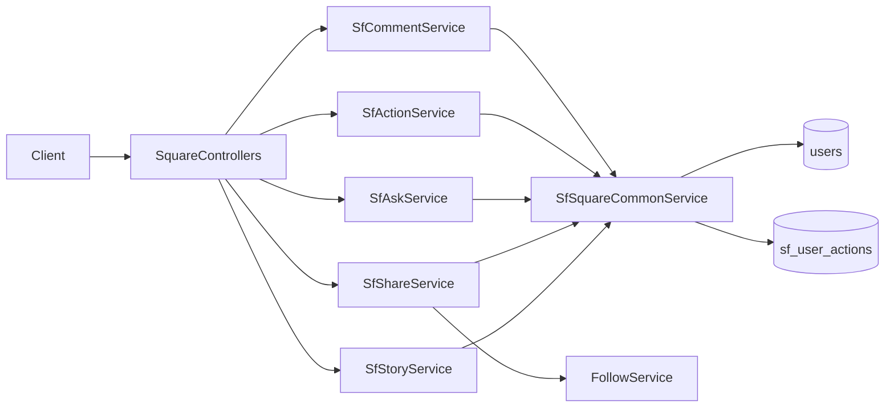

# Soul-Flower 广场模块实现计划

路径仍挂在 `/api/soul-flower/app/*`，JWT 使用 `req.user.id`（与现网一致，不用文档里的 `req.user.userId`）。成功响应继续走全局 [ResponseInterceptor](src/common/interceptors/response.interceptor.ts)，handler 只返回 `data` 内容。

第一期不做：推荐、热度排序、全文搜索、举报、后台管理。

## 相对需求文档的对齐项

这些改动是为了贴合现网约定，前端需按此联调：

- **分页**：全项目使用 `page` + `pageSize`（默认 1/20，上限 50），返回 `{ items, total, page, pageSize }`，不用文档的 `limit` / `data`。
- **用户字段**：作者信息对齐 Follow 模块：`{ id, nickName, avatarUrl }`。User 无 `level`，不编造等级。
- **联表**：不用 `$lookup`，沿用 Follow 的 `$in` + 内存 Map 批量组装。
- **错误**：`BadRequestException` / `NotFoundException` / `ForbiddenException`，由全局过滤器包装。

合理补全（文档有字段但接口逻辑未写清）：

- **匿名**：`isAnonymous=true` 时对外掩码为 `{ id: null, nickName: '匿名用户', avatarUrl: '' }`；作者本人仍可见真实身份。
- **草稿**：公开列表/他人详情排除 `isDraft: true`；作者可看自己的草稿详情。
- **分享可见范围**：列表/详情按 `visibleRange` 过滤——`public` 全员；`friends` 仅作者及「当前用户关注的人」；`private` 仅作者。复用 [user_follows](src/follow/schemas/user-follow.schema.ts)。
- **问问浏览**：`GET /asks/:id` 时 `$inc viewCount`。
- **问问评论计数**：`sf_asks` 补 `commentCount`（文档允许对 ask 评论，但主表漏了该字段）。

## 目录与模块拆分

不往 [soul-flower.service.ts](src/soul-flower/soul-flower.service.ts) 加代码。在 `src/soul-flower/square/` 下新建子模块，由 [SoulFlowerModule](src/soul-flower/soul-flower.module.ts) `imports: [SfSquareModule]`。

```
src/soul-flower/square/
  sf-square.module.ts
  sf-square.constants.ts          # 枚举、长度上限、分页默认值
  sf-square-common.service.ts     # ObjectId 校验、分页、作者组装、批量互动状态、目标表 $inc
  schemas/                        # 6 个集合
  dto/
  sf-action.service.ts + controller.ts
  sf-comment.service.ts + controller.ts
  sf-story.service.ts + controller.ts
  sf-share.service.ts + controller.ts
  sf-ask.service.ts + controller.ts
```

Controller 前缀与文档一致（全局还有 `api`）：

- `soul-flower/app/actions`
- `soul-flower/app/comments`
- `soul-flower/app/stories`
- `soul-flower/app/shares`
- `soul-flower/app/asks`

均 `@UseGuards(JwtAuthGuard)` + `@ApiBearerAuth`，Swagger tag 如 `soul-flower-square`。

`SfSquareModule` 注册 6 个新 schema + `User`；`imports: [FollowModule]`，并在 FollowService 增加 `listFolloweeIds(userId)`，供分享可见范围过滤。

## Schema

风格对齐现有 [sf-user-answer.schema.ts](src/soul-flower/schemas/sf-user-answer.schema.ts)：`@Schema({ timestamps: true, collection: 'sf_...' })`，`Types.ObjectId` + `ref: 'User'`，索引写在 SchemaFactory 之后。

常量放 [sf-square.constants.ts](src/soul-flower/square/sf-square.constants.ts)，禁止魔数：

- `SfContentStatus`: 故事 `1 正常 / 2 审核中 / 3 下架 / 4 删除`；分享/问问/回答/评论按文档各自枚举
- `SfTopicTag`: 婚恋 / 职场 / 亲子 / 成长 / 人际 / 家庭 / 其他
- `SfVisibleRange`: public / friends / private
- `SfTargetType` / `SfActionType`
- 长度：故事标题 60、正文 2000；分享正文 500、图最多 9；问问标题 100；评论 500；摘要 100 等

`sf_asks` 相对文档增加 `commentCount`（默认 0）。

`sf_user_actions` 唯一索引 `{ userId, targetType, targetId, actionType }`。送花走同一条记录 `$inc quantity`，不新插行。

## 互动（共鸣 / 收藏 / 送花）

目标表与允许的 action：

- story / share：resonate、collect、flower、comment
- ask：resonate、collect、comment（无 flowerCount）
- ask_answer：resonate、collect、flower、comment
- comment：resonate；collect 仅一级评论（`parentId == null`）

`resonate` / `collect`：有则删并 `$inc -1`，无则插并 `$inc 1`。递减带 `count > 0` 条件，避免负数。并发撞唯一索引 `11000` 时按已存在处理。

`flower`：`quantity` 默认 1，限制 1–99；`findOneAndUpdate` upsert 累加 `quantity`，主表 `$inc flowerCount`。第一期不校验余额。

返回对应最新计数字段（如 `{ resonateCount, isResonated }`）。

计数更新走 `$inc`，列表/详情禁止 `countDocuments` 实时统计。

## 评论

- `GET /comments`：`parentId: null`，`createdAt` 降序分页；批量查用户、互动状态；对当前页 rootId 一次查出子回复，内存截每条前 2 条（`createdAt` 升序）作为 `topReplies`。
- `POST /comments`：预生成 `_id`，`parentId=null`，`rootId=自身`；目标主表 `commentCount += 1`。
- `POST /comments/reply`：校验 parent/root 属于同一 `targetType+targetId`；主表 `commentCount += 1`，父评论 `replyCount += 1`。
- `GET /comments/:rootId/replies`：该根下全部子回复平铺，`createdAt` 升序，不分页；带用户信息与 `parentId`。

多集合写入：优先 Mongo 事务；若本地单机无 replica set（现有伙伴绑定已有同样回退），降级为顺序写入并打日志，与 [soul-flower.service.ts](src/soul-flower/soul-flower.service.ts) 事务回退一致。

## 故事 / 分享 / 问问



**故事**

- `GET /stories?category=`：`status=1` 且非草稿；`category` 非 `all` 时加 `topicTag`；`createdAt` 降序；附作者与 `isResonated/isCollected/isFlowered`。
- `GET /stories/:id`：下架/删除对他人 404；草稿仅作者可见。
- `POST /stories`：校验 title/content/topicTag；`authorId = req.user.id`。

**分享**

- 列表/详情按可见范围过滤，附作者与互动状态。
- `POST /shares`：`content` 与 `images` 至少一项非空；图片最多 9。

**问问**

- 列表每条附 `answerSummary`（该问下 `resonateCount` 最高回答前 100 字，无则 null）和 `answererAvatar`（匿名则掩码）；对当前页 askId **一次**查出回答后在内存取最高，禁止逐条查询。
- 详情不返回回答列表；`$inc viewCount`。
- `GET /asks/:id/answers?sort=latest|hot`：latest 按时间，hot 按 `resonateCount`；附作者与互动状态。
- `POST /asks/:id/answers`：插入回答且 `answerCount += 1`。

## 批量互动状态

列表/详情统一：收集目标 id，一次查询

```
{ userId, targetType, targetId: { $in: ids }, actionType: { $in: [...] } }
```

在内存填 `isResonated` / `isCollected` / `isFlowered`。送花以是否存在记录为准。

## 上传

在 [uploadTasks.ts](src/common/uploadTasks.ts) 增加 `sf-square-image`（jpeg/png，10MB），供封面与分享图复用现有 `/api/upload/:task`。业务只存相对路径或 ossUrl 字符串，与现网一致。

## 不改动的部分

- 现有觉察/花卡/伙伴接口与 `SoulFlowerService` 保持不动。
- 不新增 Admin 广场接口。
- 不改全局响应拦截器、JWT 结构。
